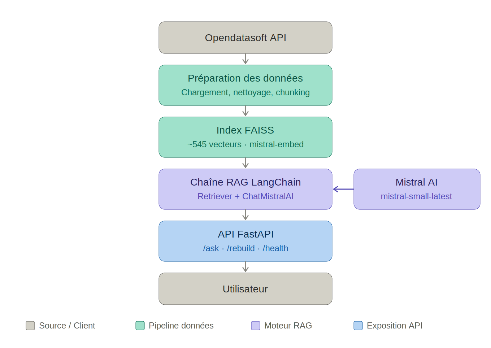

# Rapport Technique – Puls-Events

*Assistant intelligent de recommandation d'événements culturels*

Région Grenoble / Isère — POC RAG avec LangChain + Mistral AI

Dépôt : github.com/vler0ux/puls-event-rag

---

## 1. Objectifs du projet

**Contexte :** Mission confiée par Puls-Events pour concevoir un assistant intelligent de recommandation d'événements culturels dans la région Grenoble/Isère.

**Problématique :** Un système RAG (Retrieval-Augmented Generation) permet de répondre aux besoins métier en combinant la recherche sémantique dans une base vectorielle et la génération de langage naturel, offrant des réponses précises et contextualisées sur les événements locaux.

**Objectif du POC :** Démontrer la faisabilité technique d'un chatbot culturel basé sur RAG, valider la pertinence des réponses et évaluer la valeur métier pour Puls-Events.

**Périmètre :** Zone Grenoble/Isère, événements 2025, données issues de l'API Opendatasoft (516+ événements indexés).

---

## 2. Architecture du système

### Schéma global



### Technologies utilisées

- LangChain (chaîne RAG, retriever, prompts)
- Mistral AI : `mistral-embed` (embeddings) + `mistral-small-latest` (LLM)
- FAISS : base vectorielle locale persistée
- FastAPI : exposition des endpoints
- Python 3.11 / `uv` (gestion d'environnement)
- Ragas : LLM-as-a-judge

---

## 3. Préparation et vectorisation des données

### Source de données

API Opendatasoft (publique, sans clé requise) — filtre : événements culturels Grenoble/Isère, champs `firstdate_begin` / `lastdate_end`.

### Nettoyage

Normalisation des champs textuels, gestion des valeurs manquantes (description, tags), filtrage des événements sans date valide.

### Chunking

Chaque événement constitue un chunk unique (pas de découpage en sous-parties) comprenant titre, lieu, date, description et tags, avec une **taille limitée à 512 caractères**. Cette approche évite la perte de cohérence sémantique pour des contenus courts. Le retriever est configuré avec **k=6** récupérant les 6 chunks les plus proches sémantiquement pour chaque requête.

### Embedding

- Modèle : `mistral-embed` (Mistral AI API)
- Dimensionnalité : 1024 dimensions
- Traitement par batch de 50 pour respecter les limites du plan gratuit
- 545 vecteurs indexés pour 516+ événements

---

## 4. Choix du modèle NLP

### Modèle sélectionné

`mistral-small-latest` (Mistral AI) via LangChain `ChatMistralAI`.

### Justification

- Compatibilité native LangChain
- Rapport qualité/coût adapté au POC (plan gratuit disponible)
- Cohérence avec le modèle d'embedding (écosystème Mistral homogène)

### Limites

- Plan gratuit : rate limiting impactant l'évaluation Ragas (`answer_relevancy` non calculable)
- Pas de garantie de fraîcheur des données au-delà de l'index FAISS

---

## 5. Construction de la base vectorielle

### FAISS

Index FAISS de type `IndexFlatL2` stockant 545 vecteurs de dimension 1024.

### Stratégie de persistance

- Format : FAISS local (`faiss_index.bin` + docstore JSON)
- Nommage : `faiss_index/` dans le répertoire `data/`
- Reconstruction possible via l'endpoint `/rebuild`

### Métadonnées associées

- Titre de l'événement
- Lieu et ville
- Date (`firstdate_begin`)
- Description courte
- Tags / mots-clés
- URL canonique (`canonicalurl`)

---

## 6. API et endpoints exposés

### Framework

FastAPI : génération automatique de la documentation interactive (Swagger UI / ReDoc) et validation des données via Pydantic.

### Endpoints clés

- `/ask` (POST) : reçoit une question utilisateur, retourne la réponse RAG + sources
- `/rebuild` (POST) : reconstruit l'index FAISS depuis l'API Opendatasoft
- `/health` (GET) : vérification de l'état du service

### Exemple d'appel

```bash
curl -X POST http://localhost:8000/ask \
  -H "Content-Type: application/json" \
  -d '{"question": "Quels concerts à Grenoble en juin ?"}'
```

---

## 7. Évaluation du système

### Jeu de test annoté

7 questions représentatives couvrant différents types de requêtes culturelles (concerts, expositions, ateliers, événements mensuels, spectacles). Les références ont été rédigées manuellement à partir des données Opendatasoft.

### Métriques d'évaluation (Ragas)

- **Faithfulness** : mesure si la réponse est ancrée dans les contextes récupérés (pas d'hallucination)
- **Context Precision** : mesure si les chunks retournés sont pertinents et bien classés

### Résultats globaux

| Métrique | Score global | Interprétation |
|---|---|---|
| Faithfulness | **0.844** | Très bonne ancrage des réponses dans les contextes récupérés, avec d'excellents scores sur les thématiques bien couvertes et quelques hallucinations sur les sujets absents ou sous-représentés dans l'index. |
| Context Precision | **0.600** | Score hétérogène : précision parfaite (1.0) quand la thématique est bien représentée dans l'index, nulle (0.0) quand les données sont absentes ou insuffisantes — ce qui tire la moyenne vers le bas.|

### Résultats par question

| Question | Faithfulness | Ctx. Precision |
|---|---|---|
| Quels concerts ont lieu à Grenoble en juin ? | **1.000** | **1.000** |
| Quels spectacles sont proposés pour les enfants à Grenoble ? | **1.000** | **1.000** |
| Y a-t-il des expositions d'art à Grenoble ? | **1.000** | **1.000** |
| Quels événements gratuits ont lieu à Grenoble ? | **1.000** | **1.000** |
| Quels festivals se déroulent dans la région de Grenoble ? | **0.875** | **1.000** |
| Y a-t-il des événements culturels à Échirolles ? | **0.600** | **0.000** |
| Quelles expositions sur l'architecture peut-on voir à Grenoble ? | **1.000** | **0.000** |
| Quels ateliers scientifiques sont proposés à Grenoble ? | **0.857** | **0.000** |
| Quels événements ont lieu au mois de mai à Grenoble ? | **0.941** | **1.000** |
| Y a-t-il des spectacles de danse à Grenoble ? | **0.167** | **0.000** |
| **Moyenne globale** | **0.844** | **0.600** |

### Analyse qualitative

- Excellente **faithfulness** sur les questions thématiques bien couvertes par l'index (concerts, spectacles enfants, expositions, événements gratuits, festivals : faithfulness = 1.0) — le système ne hallucine pas lorsque les données sont présentes.  
Résultats plus faibles sur les questions hors périmètre ou peu représentées dans l'index : la question sur la danse obtient un faithfulness de 0.167, signe que le retriever ramène des chunks peu pertinents et que le LLM peine à s'y ancrer.
- **Context Precision** nulle (0.000) pour quatre questions (Échirolles, architecture, ateliers scientifiques, danse) : les chunks retournés ne correspondent pas aux bonnes informations, ou la thématique est absente de l'index — ce qui explique les scores de faithfulness dégradés sur ces mêmes questions.  
**Context Precision** parfaite (1.000) sur six questions : quand les données sont bien représentées, le retriever classe correctement les chunks pertinents en tête de liste.
- **Answer Relevancy** non calculable en raison du rate limiting Mistral (plan gratuit) — à ré-évaluer avec un plan payant.

---

## 8. Recommandations et perspectives

### Ce qui fonctionne bien

- Pipeline RAG complet et fonctionnel de bout en bout
- Qualité des réponses satisfaisante pour les événements bien décrits
- API FastAPI stable, endpoints documentés

### Limites du POC

- Couverture thématique limitée aux événements indexés (pas de mise à jour automatique)
- Rate limiting Mistral empêche l'évaluation complète sur le plan gratuit
- Pas de gestion de contexte conversationnel (questions de suivi)

### Améliorations possibles

- Évaluation Ragas complète des métriques (plan Mistral payant)
- faire une couverture tests unitaires 100%
- cache local pour embeddings pour les /rebuild
- Passer à ChromaDB en remplacement de FAISS (mises à jour incrémentales)
- Utiliser une interface Streamlit enrichie
- Filtres géographiques et thématiques
- Fine-tuning du modèle d'embedding
- L'intégration d'un système de feedback utilisateur
- Déploiement cloud (Railway / Fly.io)
- Mise en place d'un workflow CI/CD : tests automatisés + build Docker + déploiement.
- Profil utilisateur et personnalisation
- Scraper des sites d’évènements pour enrichir et actualiser la base de données

---

## 9. Organisation du dépôt GitHub

Dépôt : [github.com/vler0ux/puls-event-rag](https://github.com/vler0ux/puls-event-rag)

```
puls-events-rag/
├── .env          # Modèle de configuration (jamais versionné : .env)
├── .gitignore
├── README.md
├── pyproject.toml          # Dépendances (uv)
├── rapport_technique.md
├── Dockerfile
│
├── data/
│   ├── raw/                # Données brutes OpenAgenda (ignoré par git)
│   └── processed/          # CSV nettoyé prêt à indexer (ignoré par git)
│
├── index/                  # Index FAISS sauvegardé (ignoré par git)
│
├── scripts/
│   ├── collect_data.py     # Collecte via API Opendatasoft
│   ├── collect_check.py    
│   ├── build_index.py      # Vectorisation + indexation FAISS
│   └── evaluate_rag.py     # Évaluation automatique Ragas
│
├── rag/
│   ├── retriever.py        # Recherche sémantique FAISS
│   └── chain.py            # Chaîne LangChain RAG
│
├── api/
│   └── main.py             # API FastAPI
│
├── tests/
│   ├── test_data.py        # Tests collecte et nettoyage
│   ├── test_index.py       # Tests indexation FAISS
│   └── test_api.py         # Tests API REST
│
└── docs/
    ├──  evaluation_resultsRagas.json
    └── qa_dataset.json     # Jeu de test annoté (questions / réponses de référence)
```
```

---

## 10. Annexes

### Extrait du jeu de test annoté

**Q :** *"Quels concerts ont lieu à Grenoble en juin ?"*

**Référence :** *"En juin 2025, plusieurs concerts ont lieu à Grenoble dont la Fête de la Musique le 21 juin avec des événements comme Musique amplifié en plein air sur la Place Grenette et Michel Musique fête la musique."*

### Légende des couleurs (métriques)

- 🟢 **>= 0.75** : bon score
- 🟠 **0.50 – 0.74** : score moyen, améliorable
- 🔴 **< 0.50** : score faible
- ⚪ **N/A** : métrique non disponible